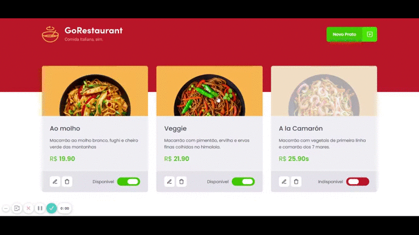

<p align="center">
  
</p>

<h1 align="center">
GoRestaurant
</h1>

<p align="center">

  

  

  <a href="https://www.linkedin.com/in/alquiponeto/">
      
  </a>

  <a href="https://github.com/Alquipo/gorestaurant/commits/master">
      
  </a>

  

<p align="center">

  <a target="_blank" href="https://reactjs.org/">
    
  </a>
</p>

<h1 align="center">
  Bem Vindo ao App GoRestaurant
</h1>

## 🚀 Sobre o Projeto

GoRestaurant e uma aplicação desenvolvida e um desafio complementar do bootcamp Ignite da Rocketseat, proposta do desafio converter toda aplicação para Typescript e trocar as classes para funções e hooks do react

## 🎨 Layout

<h4 align="center">
  
</h4>

<br/>

## :tada: Melhorias na Aplicação

    -Convertido o projeto para TypeScript;
    -Convertido as classe para funções hooks;

## 🔨 Tecnologias:

- **[TypeScript](https://www.typescriptlang.org/)**
- **[Axios](https://github.com/axios/axios)**
- **[Styled Components](https://styled-components.com/)**

## 🔎 Comandos

- `start`: Executa a aplicação em `localhost:3000`
- `server`: Executa o servidor da aplicação em `localhost:3333`

## 🚀 Como rodar este projeto

Para clonar e executar este aplicativo, você precisará de [Git](https://git-scm.com) e [NodeJs](https://nodejs.org/en/) Instalado em seu computador.

### 🌀 Clonando o repositório

```bash
# Clone este repositório
$ git clone https://github.com/Alquipo/gorestaurant

# Acesse a pasta do projeto no terminal/cmd
$ cd gorestaurant
```

### 🎲 Rodando a Aplicação

```bash
# Instale as dependências
$ yarn install

# Execute o Servidor da Aplicação (Fake API)
$ yarn server

# Execute a Aplicação em Desenvolvimento
$ yarn start

# A aplicação será aberta na porta:3000 - acesse http://localhost:3000

# O servidor será executado na porta:3333 - acesse http://localhost:3333

```

## 🤔 Como contribuir para o projeto

- Faça um **fork** do projeto;
- Crie uma nova branch com as suas alterações: `git checkout -b my-feature`
- Salve as alterações e crie uma mensagem de commit contando o que você fez:`git commit -m "feature: My new feature"`
- Envie as suas alterações: `git push origin my-feature`

> Caso tenha alguma dúvida confira este [guia de como contribuir no GitHub](https://github.com/firstcontributions/first-contributions)

## 📝 Licença

Este projeto esta sobe a licença MIT. Veja a [LICENÇA](https://opensource.org/licenses/MIT) para saber mais.

Feito com ❤️ por Alquipo Neto 👋🏽 [Entre em contato!](https://www.linkedin.com/in/alquiponeto/)
